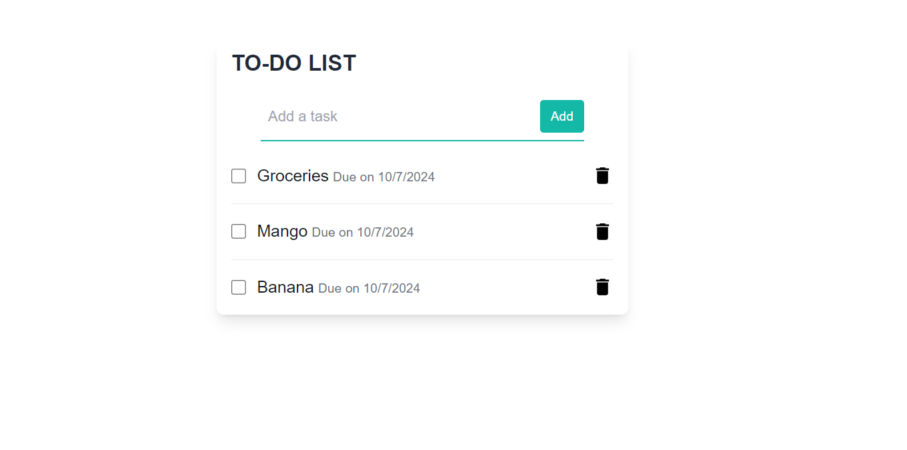

## Todo Project 
This project is a simple todo list application that allows users to add, edit and delet tasks. The project is built using Express.js, MongoDB, EJS,Tailwind CSS and Socket.io.

## Features
- Add a task
- Edit a task
- Delete a task
- Mark a task as completed
- Real-time updates using Socket.io

## Installation
1. Clone the repository
2. Run `npm install` to install the dependencies
3. Create a `.env` file in the root directory and add the following environment variables:
```
MONGO_URI=your_mongo_uri
PORT=3000
```
4. Run `npm start` to start the server
5. Visit `http://localhost:3000` to view the application

## Screenshots
